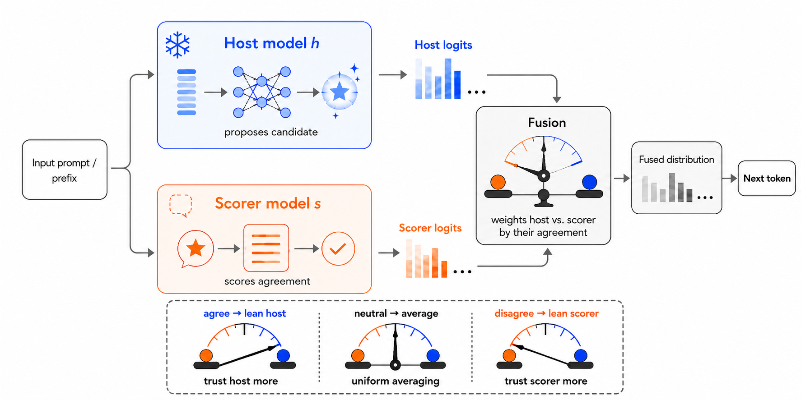

# Constrained Decoding for Large Language Models

**Test-Time Logit Fusion for Low-Resource Language Adaptation**

This repository is the data analysis pipeline for a research project of
the MPhil in Data Intensive Science at the University of Cambridge. The
project report and the executive summary are submitted separately. The
report describes the method and the results. This README describes how
to install the pipeline, how to run every method, and how to reproduce
every number in the report.

The project studies decoding-time logit fusion for adapting large
language models to low-resource languages. Its objectives are to
(i) reproduce two published fusion baselines, Proxy Tuning and TriMix,
inside one controlled framework, (ii) propose SAF-W, a training-free
per-token fusion of a host and a scorer model, (iii) select the SAF-W
host per task and language on development data only, (iv) measure all
methods across three backbone scales, four languages, and six tasks,
and (v) confirm the findings on a second model family.



*SAF-W at one decoding step. The host proposes its top token. The
scorer reports the probability it assigns to that token. This
endorsement sets the mixing weight, and the fused logits decode the
step.*

## Table of Contents

- [Data Availability](#data-availability)
  - [Datasets](#datasets)
  - [Models](#models)
  - [Results](#results)
- [Installation](#installation)
  - [Requirements](#requirements)
  - [Local setup](#local-setup)
  - [Docker](#docker)
  - [Determinism](#determinism)
- [Usage](#usage)
  - [Pipeline architecture](#pipeline-architecture)
  - [The declaration driver](#the-declaration-driver)
  - [Scripts](#scripts)
  - [Reproduce the results from scratch](#reproduce-the-results-from-scratch)
  - [On the cluster](#on-the-cluster)
- [Repository Layout](#repository-layout)
- [Testing](#testing)
- [Documentation](#documentation)
- [Use of Auto-generation Tools](#use-of-auto-generation-tools)
- [Support](#support)
- [License](#license)
- [Project Status](#project-status)
- [Authors and Acknowledgment](#authors-and-acknowledgment)

## Data Availability

### Datasets

The MiLiC-Eval splits ship with the repository under `data/`. The
languages are Tibetan (`bo`), Uyghur (`ug`), Mongolian (`mn`), and
Kazakh (`kk`). Each task directory holds one directory per language:

| Task | Directory | Exemplars used | Metric |
| --- | --- | --- | --- |
| Reading comprehension | `reading_comprehension` | 5 | accuracy |
| Response selection | `response_selection` | 5 | accuracy |
| Title generation | `title_generation_200` | 3 | ROUGE-L |
| Math (English CoT) | `math` | 5 | accuracy |
| Translation, both directions | `translation_dialogue` | 5 | chrF++ |

Each language directory holds a `test.json`, a small `dev.json`, and
the exemplar files `train_1.json`, `train_2.json`, and `train_3.json`.
Every example carries an `id` and the task fields the prompt builders
in `safw/prompts.py` expect. All runs draw their few-shot exemplars
from `train_1.json`, in file order.

Host selection uses an expanded development set called devx. The devx
set merges `dev` with `train_2` and `train_3` and leaves `train_1`
untouched, so the exemplar file never overlaps the selection data. The
set holds 40 items for reading comprehension and 80 for the other
selection tasks. `scripts/make_devx.py` builds it and de-duplicates by
id.

### Models

All checkpoints are frozen and public on Hugging Face:

| Family | Role | Checkpoint |
| --- | --- | --- |
| Qwen | host / base | `Qwen/Qwen2.5-7B-Instruct`, `-14B-`, `-32B-` |
| Qwen | scorer / expert | `pkupie/Qwen2.5-1.5B-<lang>-cpt` |
| Qwen | antiexpert (baselines) | `Qwen/Qwen2.5-1.5B` |
| Gemma | host / base | `google/gemma-3-12b-it`, `-27b-it` |

Models load in bfloat16. On a cluster without internet access, set
`HF_HUB_OFFLINE=1` and `TRANSFORMERS_OFFLINE=1` and point the Hugging
Face cache at a pre-downloaded directory. The cluster wrapper
`scripts/run.sh` sets both variables.

### Results

Results live under `results/` in two trees.

`results/devx/` holds the host-selection scores behind the selection
table in the report. One file per task, language, and scale records
both host scores on the devx set.

`results/test_outputs/` holds every test run. `scripts/canonical.py`
is the single source of truth for the layout:

```text
results/test_outputs/{method}/{family}/{lang}/{task}/
    {method}_{family}_{lang}_{task}_{key}_preds.json
    {method}_{family}_{lang}_{task}_{key}_metrics.json
```

The key is `ins{scale}` or `cpt{size}` for single models, `{scale}`
for the three-model baselines and uniform averaging, and
`inshost{scale}` or `cpthost{scale}` for SAF-W. The predictions file
maps example id to the generated text. The metrics file carries a
metadata header, for example:

```json
{
    "metric": "accuracy",
    "value": 0.585,
    "n": 200,
    "source_run": "saf_qwen_bo_rc_cpthost32B_preds.json",
    "key": "cpthost32B",
    "task": "rc",
    "lang": "bo",
    "family": "qwen",
    "method": "saf"
}
```

Files are populated from the CSD3 runs. They start as zero-byte
placeholders. A zero-byte file never blocks a run and never counts as
evaluated. Audit the unfilled files at any time with:

```bash
find results/test_outputs -name "*.json" -size 0 | wc -l
```

## Installation

### Requirements

- Python 3.10 or newer
- PyTorch 2.5 with CUDA, Transformers 4.47, Accelerate, sacrebleu,
  SentencePiece (all pinned in `requirements.txt`)
- A CUDA GPU for inference. The 7B and 14B pairs fit one 48 GB card.
  The 32B pairs need two 48 GB cards or one 80 GB card.
- Docker, if you prefer the containerised setup

### Local setup

1. Clone the repository and enter it:

```bash
git clone https://github.com/tianshuai-gao/SAF.git
cd SAF
```

2. Install the package and its pinned dependencies:

```bash
pip install -e .
```

3. Install the multilingual ROUGE fork. Title generation is scored
with the XL-Sum fork. It installs as `rouge_score` and must override
the official package:

```bash
pip install pyonmttok
pip install "git+https://github.com/csebuetnlp/xl-sum.git#subdirectory=multilingual_rouge_scoring"
```

4. Verify the correct scorer is active:

```bash
python -c "from rouge_score import rouge_scorer; import inspect; \
assert 'kwargs' in str(inspect.signature(rouge_scorer.RougeScorer.__init__)), 'wrong rouge'; \
print('multilingual fork OK')"
```

Do not install the official `rouge-score` package at any point. It
shares the import name and silently deflates the title scores by
roughly a factor of three.

5. Optional extras:

```bash
pip install -e ".[test]"   # pytest
pip install -e ".[docs]"   # Sphinx
```

### Docker

1. Install Docker from the official page and start the daemon.

2. Build the image from the repository root:

```bash
docker build -t safw:latest .
```

The build installs everything above and runs the ROUGE assertion. A
wrong scorer fails the build.

3. Run the unit tests inside the container:

```bash
docker run --rm safw:latest pytest tests/ -q
```

4. Run inference with GPU access. Mount the working directory and a
Hugging Face cache so weights are not baked into the image:

```bash
docker run --gpus all -v $PWD:/workspace \
    -v /path/to/hf_cache:/root/.cache/huggingface \
    safw:latest python -m scripts.run --method safw --lang bo --scale 7B --host ins
```

5. On an HPC system without Docker, run the same image through
Apptainer with GPU pass-through:

```bash
apptainer exec --nv docker://tianshuai2024/safw:latest python -c \
    "import torch; assert torch.cuda.is_available()"
```

### Determinism

Greedy decoding is used throughout, so there is no sampling. For
bit-reproducible matrix operations on Ampere GPUs, set:

```bash
export CUBLAS_WORKSPACE_CONFIG=:4096:8
```

The Docker image and the cluster wrapper set this automatically. The
few-shot exemplars are fixed files read in order, so prompts are
identical across runs.

## Usage

### Pipeline architecture

Three layers with one job each. `scripts/run.py` declares a batch of
runs and validates the declaration. `scripts/infer.py` executes one
run. `scripts/canonical.py` decides where every output lands.
`scripts/eval.sh` sweeps the results tree and scores whatever is new.
The task settings, namely the data paths, the exemplar counts, and the
generation lengths, live once inside the driver.

### The declaration driver

```bash
python -m scripts.run --method safw --lang bo --scale 32B --host cpt --dry_run
```

| Flag | Meaning |
| --- | --- |
| `--method` | `single`, `safw`, `safw_fixed`, `proxy`, or `trimix` |
| `--family` | `qwen` (default) or `gemma` |
| `--lang` | `bo`, `ug`, `mn`, or `kk` |
| `--scale` | `7B`, `14B`, `32B`, `12B`, or `27B`. Not used by the single cpt model |
| `--host` | `ins` or `cpt`. SAF-W and single only |
| `--tasks` | any of `rc rs title math xx2en en2xx`. Defaults to all six |
| `--host_model`, `--scorer_model` | explicit SAF-W model overrides |
| `--base_model`, `--expert_model`, `--antiexpert_model` | explicit baseline overrides |
| `--beta_fixed` | constant scorer weight for `safw_fixed` (default 0.5) |
| `--alpha` | Proxy Tuning residual weight (default 1.0) |
| `--base_weight`, `--expert_weight` | TriMix weights (defaults 1.0) |
| `--plausibility_alpha` | TriMix masking threshold (default 0.1) |
| `--data_root` | data directory (default `data`) |
| `--dry_run` | print the plan and exit |

Model paths resolve from a built-in zoo, so the common runs need no
paths at all. Every declaration is cross-checked against the resolved
model names. The driver refuses to run when the scale does not match
the model, when the language does not match the CPT checkpoint, when a
model sits in the wrong slot, when a flag does not apply to the
method, or when a required declaration is missing. Each refusal exits
non-zero with a one-line reason. `--dry_run` prints one plan line per
task, including the exact output path, and exits.

### Scripts

**`scripts/infer.py`** is the parametrised engine underneath the
driver. It runs one task for one method with explicit paths:

```bash
python -m scripts.infer --method safw \
    --host_model Qwen/Qwen2.5-7B-Instruct \
    --scorer_model pkupie/Qwen2.5-1.5B-bo-cpt \
    --task reading_comprehension --eval_lang bo --prompt_lang en \
    --num_exemplar 5 --max_new_tokens 2 \
    --input_file data/reading_comprehension/bo/test.json \
    --exemplar_file data/reading_comprehension/bo/train_1.json \
    --output_file /tmp/bo_rc_preds.json
```

`--method single` decodes `--host_model` on its own. `--method safw`
and `safw_fixed` take `--host_model` and `--scorer_model`. `--method
proxy` and `trimix` take `--base_model`, `--expert_model`, and
`--antiexpert_model` plus their weights. Task flags cover
`--num_exemplar`, `--max_new_tokens`, `--max_passage_len` for title
passages, `--src_lang` and `--tgt_lang` for translation,
`--batch_size`, and `--load_in_8bit`. A non-empty output file stops
the run, so nothing is ever overwritten.

**`scripts/canonical.py`** resolves the storage path for one run and
can be called on its own:

```bash
python -m scripts.canonical --method safw --lang bo --task rc \
    --models pkupie/Qwen2.5-1.5B-bo-cpt Qwen/Qwen2.5-32B-Instruct
```

prints `results/test_outputs/saf/qwen/bo/rc/saf_qwen_bo_rc_cpthost32B`.
Pass the host or base model first.

**`scripts/evaluate.py`** scores one predictions file against its
reference file and writes the metrics file with the metadata header:

```bash
python -m scripts.evaluate --task reading_comprehension \
    --input_file data/reading_comprehension/bo/test.json \
    --pred_file <preds.json> --metrics_output_file <metrics.json> \
    --source_run <preds filename>
```

**`scripts/eval.sh`** walks `results/test_outputs`, finds every
non-empty `*_preds.json` without a metrics file, reads the task and
the language from the path, and calls the evaluator. The sweep is
idempotent, so re-running it never re-scores a finished cell.

**`scripts/get_perplexity.py`** selects the TriMix weights. It sweeps
the grid `{0.1, 0.3, 0.5, 0.7, 0.9, 1.0}` for the base and expert
weights, computes the perplexity of the weighted three-model
combination on a sampled development set, and reports the lowest
combination. The sweep uses no labels and runs before the main
inference.

**`scripts/make_devx.py`** builds the devx selection set by merging
`dev.json` with `train_2.json` and `train_3.json` and de-duplicating
by id:

```bash
python -m scripts.make_devx \
    --dev_file data/reading_comprehension/bo/dev.json \
    --extra_files data/reading_comprehension/bo/train_2.json \
                  data/reading_comprehension/bo/train_3.json \
    --output_file data/reading_comprehension/bo/devx.json
```

### Reproduce the results from scratch

1. Install the package and the ROUGE fork as above and download the
models, or run offline against a pre-filled cache.

2. Decode the single-model rows. The cpt model has a fixed size, so it
runs once per language:

```bash
for LANG in bo ug mn kk; do
  python -m scripts.run --method single --lang $LANG --host cpt
  for SCALE in 7B 14B 32B; do
    python -m scripts.run --method single --lang $LANG --scale $SCALE --host ins
  done
done
```

3. Decode SAF-W under both host assignments:

```bash
for LANG in bo ug mn kk; do
  for SCALE in 7B 14B 32B; do
    python -m scripts.run --method safw --lang $LANG --scale $SCALE --host ins
    python -m scripts.run --method safw --lang $LANG --scale $SCALE --host cpt
  done
done
```

The deployed host per cell follows the devx selection recorded under
`results/devx` and reported in the paper. The math task is not decoded
here, because SAF-W decodes math with uniform averaging.

4. Decode uniform averaging, the symmetric `beta = 0.5` reduction:

```bash
for LANG in bo ug mn kk; do
  for SCALE in 7B 14B 32B; do
    python -m scripts.run --method safw_fixed --lang $LANG --scale $SCALE
  done
done
```

5. Decode Proxy Tuning:

```bash
for LANG in bo ug mn kk; do
  for SCALE in 7B 14B 32B; do
    python -m scripts.run --method proxy --lang $LANG --scale $SCALE
  done
done
```

6. Decode TriMix. First select its weights per task and language, then
run with the selected values:

```bash
python -m scripts.get_perplexity --task reading_comprehension --eval_lang bo \
    --base_model Qwen/Qwen2.5-7B-Instruct \
    --expert_model pkupie/Qwen2.5-1.5B-bo-cpt \
    --antiexpert_model Qwen/Qwen2.5-1.5B
python -m scripts.run --method trimix --lang bo --scale 7B \
    --tasks rc --base_weight 0.1 --expert_weight 1.0
```

7. Score everything and audit:

```bash
bash scripts/eval.sh
find results/test_outputs -name "*.json" -size 0 | wc -l
```

### On the cluster

`scripts/run.sh` is a thin SBATCH wrapper around the driver for the
Cambridge CSD3 Ampere partition. It loads the environment, sets the
offline and determinism variables, and forwards every argument:

```bash
sbatch scripts/run.sh --method safw --lang bo --scale 32B --host cpt
```

One submission covers one method, language, and scale across the
declared tasks. Logs land in `logs/`. Long-generation tasks, namely
title and translation, dominate the wall clock.

## Repository Layout

```text
safw/                the package
  dexperts.py          the decoders: Proxy Tuning, TriMix, SAF-W
  utils.py             cached batched generation and model loading
  prompts.py           prompt builders for the six tasks
  eval.py              accuracy, chrF++, and multilingual ROUGE-L
scripts/
  run.py               declaration driver and task table
  run.sh               SBATCH wrapper for CSD3
  infer.py             single-run inference engine
  canonical.py         single source of truth for output paths
  evaluate.py          scores one predictions file
  eval.sh              idempotent scoring sweep over the results tree
  get_perplexity.py    TriMix weight selection by perplexity
  make_devx.py         builds the devx host-selection set
data/                MiLiC-Eval splits per task and language
results/
  devx/                host-selection scores behind the paper table
  test_outputs/        canonical tree of predictions and metrics
exploration/
  records/             development-time diagnostics, kept for provenance
docs/                Sphinx documentation
tests/               unit tests
runpod/              environment setup for ad-hoc GPU pods
Dockerfile           CUDA runtime image with the ROUGE assertion
```

Paper-facing numbers live only under `results/`. The material under
`exploration/records/` documents the development process, including
the host-selection ablations discussed in the report.

## Testing

```bash
pytest tests/ -q
```

Twenty-three tests cover the SAF-W fusion rule, the uniform-averaging
reduction, the first-token anchor, and the declaration checks of the
driver, including three accepted configurations and twelve refusals.
The GitLab CI runs the same suite on every push.

## Documentation

1. Install the extras and build:

```bash
pip install -e ".[docs]"
python -m sphinx -b html docs docs/_build/html
```

2. Open `docs/_build/html/index.html`.

The pages cover the method with full equations, installation, a
quickstart, the reproduction guide, the data layout, and the API
reference generated from the docstrings.

## Use of Auto-generation Tools

Claude (Anthropic) assisted with code, experiment orchestration,
debugging, and report drafting. Every generated artefact was reviewed,
tested, and verified by the author. The full declaration, itemised by
activity, is in the appendix of the project report.

## Support

For questions, feedback, or assistance, contact tg561@cam.ac.uk.

## License

This project is licensed under the MIT License. See the LICENSE file.

## Project Status

The pipeline is complete. The results tree is populated from the CSD3
runs; audit the remaining unfilled files with the command in
[Results](#results).

## Authors and Acknowledgment

Tianshuai Gao, Sidney Sussex College, University of Cambridge, MPhil
in Data Intensive Science, supervised by Dr Weiwei Sun. The decoding
framework extends the released TriMix codebase, and the CPT
checkpoints follow the TriMix release. Evaluation uses the MiLiC-Eval
benchmark. Experiments ran on the Cambridge Service for Data Driven
Discovery (CSD3).
